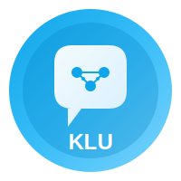

# KLU Agent - AI Campus Assistant

A production-ready full-stack Gen AI-powered chatbot for KL University, featuring a RAG (Retrieval-Augmented Generation) pipeline with dual-source architecture.



## 🚀 Features

- **Intelligent Chat Interface** - Natural language conversations with context-aware responses
- **Dual-Source Architecture** - Combines Vector Database (documents) + SQL Database (structured data)
- **RAG Pipeline** - Document ingestion, chunking, embedding, and semantic search
- **LangChain Agents** - Intelligent routing between document search and database queries
- **Admin Dashboard** - Document management, database stats, and system monitoring
- **Dark Theme UI** - Modern, responsive design with glassmorphism effects

## 🏗️ Architecture

```
┌─────────────────┐     ┌─────────────────┐
│   React + Vite  │────▶│   FastAPI       │
│   Frontend      │     │   Backend       │
└─────────────────┘     └────────┬────────┘
                                 │
                    ┌────────────┼────────────┐
                    │            │            │
              ┌─────▼─────┐ ┌────▼────┐ ┌─────▼─────┐
              │ ChromaDB  │ │ SQLite  │ │ LangChain │
              │ (Vectors) │ │   DB    │ │  Agents   │
              └───────────┘ └─────────┘ └───────────┘
```

## 📁 Project Structure

```
KLU-Agent/
├── backend/
│   ├── app/
│   │   ├── config.py           # Settings & environment variables
│   │   ├── main.py             # FastAPI application
│   │   ├── models/             # Database & Pydantic models
│   │   ├── routers/            # API endpoints
│   │   ├── services/           # Business logic & AI services
│   │   └── seed/               # Database seeding & sample docs
│   ├── requirements.txt
│   ├── run.py
│   └── .env.example
│
├── frontend/
│   ├── src/
│   │   ├── components/         # React components
│   │   ├── pages/              # Page components
│   │   ├── hooks/              # Custom React hooks
│   │   ├── context/            # React context providers
│   │   ├── api/                # Axios API client
│   │   └── utils/              # Helper functions
│   ├── package.json
│   └── vite.config.js
│
└── README.md
```

## 🛠️ Tech Stack

### Backend
- **Python 3.11+**
- **FastAPI** - High-performance async web framework
- **LangChain** - RAG pipeline & agent orchestration
- **ChromaDB** - Vector database for document embeddings
- **SQLAlchemy** - ORM for SQLite database
- **OpenAI / Google Gemini** - LLM providers (configurable)
- **Sentence Transformers** - Embedding models

### Frontend
- **React 18** - UI framework
- **Vite** - Build tool
- **Tailwind CSS** - Utility-first styling
- **Framer Motion** - Animations
- **React Router** - Client-side routing
- **Axios** - HTTP client

## 🚦 Getting Started

### Prerequisites

- Python 3.11+
- Node.js 18+
- OpenAI API key OR Google Gemini API key

### Backend Setup

1. Navigate to the backend directory:
```bash
cd backend
```

2. Create a virtual environment:
```bash
python -m venv venv
source venv/bin/activate  # On Windows: venv\Scripts\activate
```

3. Install dependencies:
```bash
pip install -r requirements.txt
```

4. Create `.env` file from template:
```bash
cp .env.example .env
```

5. Configure your `.env` file:
```env
# LLM Configuration (choose one)
LLM_PROVIDER=openai
OPENAI_API_KEY=your-openai-api-key

# OR for Gemini
# LLM_PROVIDER=gemini
# GOOGLE_API_KEY=your-gemini-api-key
```

6. Seed the database (optional):
```bash
python -m app.seed.seed_database
```

7. Start the backend server:
```bash
python run.py
```

The API will be available at `http://localhost:8000`

### Frontend Setup

1. Navigate to the frontend directory:
```bash
cd frontend
```

2. Install dependencies:
```bash
npm install
```

3. Start the development server:
```bash
npm run dev
```

The app will be available at `http://localhost:5173`

## 📡 API Endpoints

### Chat
- `POST /api/chat` - Send a message
- `GET /api/chat/history/{session_id}` - Get chat history
- `DELETE /api/chat/history/{session_id}` - Clear chat history
- `GET /api/chat/sessions` - List chat sessions

### Documents
- `POST /api/documents/upload` - Upload a document
- `GET /api/documents` - List all documents
- `DELETE /api/documents/{doc_id}` - Delete a document
- `GET /api/documents/stats` - Get vector store stats

### Admin
- `GET /api/admin/db-stats` - Database statistics
- `GET /api/admin/system-info` - System information

### Health
- `GET /api/health` - Health check
- `GET /api/health/ready` - Readiness check

## 🎨 Features Overview

### Chat Interface
- Natural language conversation
- Markdown rendering with syntax highlighting
- Source attribution (document or database)
- Response time display
- Chat session management
- Suggestion chips for quick queries

### Admin Dashboard
- **Documents Tab**: Upload, view, and delete knowledge base documents
- **Database Tab**: View statistics for all database tables
- **System Tab**: Monitor LLM provider, embedding model, and uptime

### AI Capabilities
- Semantic search over uploaded documents
- Natural language to SQL queries
- Intelligent query routing
- Context-aware responses with conversation memory

## 📄 Sample Data

The backend includes sample data for:
- **College Database**: Students, Faculty, Courses, Departments, Events, Admissions, Facilities
- **Knowledge Base**: KLU about info, academic policies, placement statistics

## 🔧 Configuration

### Environment Variables

| Variable | Description | Default |
|----------|-------------|---------|
| `LLM_PROVIDER` | LLM provider (openai/gemini) | openai |
| `OPENAI_API_KEY` | OpenAI API key | - |
| `GOOGLE_API_KEY` | Google Gemini API key | - |
| `DATABASE_URL` | SQLite database path | sqlite:///./data/college.db |
| `CHROMA_PERSIST_DIR` | ChromaDB storage path | ./data/chroma |
| `HOST` | Server host | 0.0.0.0 |
| `PORT` | Server port | 8000 |

## 📜 License

This project is for educational purposes.

---

Built with ❤️ for KL University
